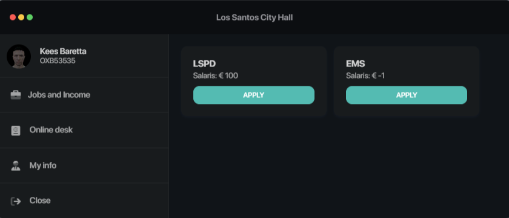
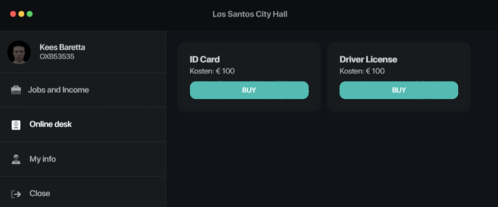
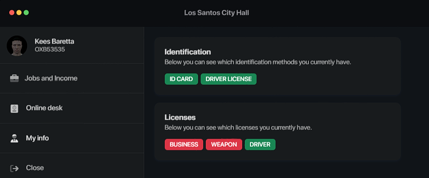

# MTC Cityhall

## Our links
- [Discord](https://discord.gg/APFHf9hhkG)
- [Tebex (Paid scripts)](https://mtc.tebex.io/)

### How to use it?

1. Clone the repository
2. Rename the folder to `mtc-cityhall`
3. Start the script
4. Trigger the event `mtc-cityhall:client:open` or the `Open` export.

### Dependencies

- [qb-core](https://github.com/qbcore-framework/qb-core) or [qbx-core](https://github.com/Qbox-project/qbx-core)

### How to change the UI language?

1. Go to 'html/js/lang.js'
2. Change the strings

### How to change the locale?

1. Go to 'config.lua'
2. Change the strings

3. Go to 'lang.lua',
4. Change the strings

### Showcase

## 👉 Join our community

